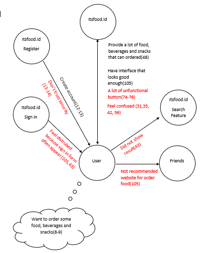

# Contextual Inquiry and Analysis
<h5>Safhira Maharani</h5>
<h5>05111740000027</h5>
<h5>Human and Computer Interaction A</h5>
<hr>

## Device/ App/ Website Description

<p>itsfood.id is a website which provide order for food, beverages and snacks. There are many of delicous food from Indonesia, Western, and Asia. While, for the beverages there are many kind Tea, Coffee, Juice and mineral water. In this website, we can order online  for some food, beverages and snacks.</p>
<p>There are many feature in this website. In this occasion, i will make a contextual inquiry and analysis for this website.</p>

## Instruction Script

<p>To make a contextual inquirity and analysis, i make some of instruction for the user. Bellow is the following instruction:</p>

*  <p>	Make a account , Try registration feature</p>
*  <p>	Try to loggin</p>
*  <p>	Try to search user’s favorite food with search feature</p>
*  <p>	Try to click order , then check troll feature</p>
*  <p>	Try to order some food</p>
*  <p>	Try to search itsfood.id facebook, twitter, instagram or linkedin account</p>
*  <p>	Try to search some information about the owner of itsfood.id.</p>
*  <p>	Try to search FAQ feature</p>

## User Description
* <p>The user is a female. </p>
* <p>She is a student in State Administration in Airlangga University.</p>
* <p>She has experience using a website. </p>
* <p>She usually use a website for shopping, look her GPA on the UNAIR website and do for her homework.</p>
* <p>because she is a student in UNAIR and never have entered ITS, she doesnot know itsfood.id.</p>
* <p>So she absolutely no experience using itsfood.id. </p>
    
## Transcript
```
1. Me       : "Apakah kamu pernah memesan makanan secara online?"
2. User     : "Pernah, pake gofood"
3. Me       : "jika ya, bagaimana cara kamu memesannya?"
4. User     : "Ya pake aplikasi, trus dapet driver, trus dianter makannannya."
5. Me       : "okay. Apakah kamu tau aplikasi web ini itsfood.id?"
6. User     : "Gatau, kan aku anak UNAIR hahaha, bener nggak sih jawabnya?"
7. Me       : "iya bener."
8. Me	    : "Jadi kali ini aku akan kasih kamu beberapa instruksi dan pertanyaan, trus kamu coba jalanin dan jawab sebisa mu aja. Goal dari percobaan ini kamu bisa order makanan/minuman/snack"
9. User	    : "Okay."
10. Me	    : "Coba kamu bikin akun di website itu"
11. User    : "oke , brati daftar ya."
12. (mencari tombol daftar, setelah muncul form , lalu user mengisi data-data yang dibutuhkan)
13. (setelah mengisi pada bagian jurusan, user diam sejenak, user terkejut dan merasa ada yang aneh)
14. User    : "eh, passwordnya kok keliatan. udah?"
15. Me      : "iyaa"
16. (user menekan tombol Daftar)
17. (lalu muncul pemberitahuan "Permintaan Anda akan diproses. Pemberitahuan akan terkirim ke email anda")
18. (user langsung menutup pemberitahuan itu tanpa membacanya)
19. User    : "oke sekarang apa?"
20. Me      : "Bukannya tadi suruh nge-cek email dulu ya?"
21. User    : "Enggak?"
22. (user terlihat tidak yakin dengan jawabannya)
23. Me      : "Okay, coba sekarang kamu Sign In pake akun yang tadi kamu buat"
24. (user mencari tombol Sign In)
25. (setelah muncul form, lalu user mengisi data-data yang dibutuhkan)
26. (user menekan tombol Masuk)
27. User    : "eh, kok ga bisa login? oh mungkin cek email dulu yaa"
28. Me      : "boleh , coba cek email"
29. (user membuka akun emailnya melalui handphone nya)
30. User    : "kok ga ada email masuk ya. berarti email ku tadi ga terdaftar."
31. (user terlihat bingung)
32. Me      : "mungkin kamu lupa pasword?"
33. User    : "coba deh."
34. (mencari tombol Lupa Password)
35. (user bingung karena tidak menemukan tombol Lupa Password)
36. Me      : "kamu cari apa?"
37. User    : "tombol Lupa Password, kok ga ada ya, brati gabisa sign in"
38. (user masih berusaha untuk mencari tombol Lupa Password)
39. Me      : "iya, ga memang ga ada."
40. User    : "owalah kirain. Aku gabisa login nih."
41. Me      : "Oke selanjutnya, coba kamu cari makanan yang kamu suka di fitur search itu"
42. (user mengetikakan 'ayam', namun tidak ada hasil dan kembali ke halaman awal, dan muncul form sign in) (user terlihat bingung)
43. User    : "kok ga bisa ya, malah muncul form sign in lagi." (user merasa terganggu adanya form sign in yang muncul lagi)
44. Me      : "Okay, instruksi selanjutnya, coba di scroll ke bawah. Coba kamu order beberapa makanan trus cek di fitur kantong belanja."
45. User    : "beberapa makanan tuh maksudnya, banyak menu atau banyak jumlah?"
46. Me      : "banyak menu."
47. (user menekan beberapa makanan untuk di pesan)
48. User    : "banyak juga ya pilihannya. trus cek ya?"
49. (user terlihat kesusahan mencari tombol fitur belanja)
50. User    : "dimana sih fitur belanjanya? "
51. (user masih kesusahan untuk mencari tombol fitur belanja, dan setelah sekian lama user menemukannya)
52. User    : "oh ini"
53. (user terlihat kaget saat melihat jumlah quantity dari makanan yang ia pesan)
54. Me      : "Apakah jumlah dari setiap makanan sesuai dengan yang kamu klik?"
55. User    : "Enggak, kok ini jadi banyak banget ya. Padahal aku tadi klik cuman sekali aja."
56. (user terlihat bingung)
57. Me      : "oke, instruksi selanjutnya. Coba kamu order makanan."
58. User    : "oke."
59. (user kembali ke halaman awal)
60. (user memilih makanan yang akan dia pesan)
61. (user menekan tombol fitur kantong belanja)
62. (user terlihat bingung)
63. User    : "yang ini ya?" 
64. (user menunjukkan tombol 'updates and checkout')
65. Me      : "iya"
66. (user menekan tombol 'updates and checkout')
67. User    : "ya ga bisa order ,kan belom bisa login. Trus ini form order nya terlalu kekanan jadi yang bawah ini (dibawah pembelian order) jadi kosong."
68. Me      : "Coba kamu cari tombol OA nya dari itsfood.id, instagram, facebook, twitter dan, linked in."
69. User    : "oke"
70. (user terlihat kebingungan)
71. User    : "kok ga nemu?"
72. (setelah sekian lama)
73. User    : "oh iyaa ini."
74. (user menekan tombol gambar facebook, instagram, twitter, dan linked in)
75. User    : "kok ga berfungsi yaa."
76. (user masih mencoba untuk menekan tombol itu berkali-kali)
77. Me      : "iya emang gabisa. Coba ke atas"
78. (user scroll ke atas halaman website)
79. Me      : "Coba kamu cari informasi seperti kontak HP , email, alamat yang punya website ini."
80. User    : "oke."
81. (user mencari)
82. (user menemukan ada dua halaman yang menunjukkan ada nya informasi itu)
83. User    : "ini fhir."
84. Me      : "Menurutmu apa bedanya navbar tentang kami dan kontak?"
85. (user memenekan tombol Tentang Kami dan Kontak lalu membandingkan keduanya.)
86. User    : "Menurutku kalo di halaman Tentang Kami, ada menu, kontak dan sosmed itsfood.id , kalo di halaman kontak ya cuma kontaknya aja."
87. Me      : "Menurutmu itu harusnya gimana?"
88. User    : "Kalo di halaman Tentang Kami tuh seharusnya deskripsiin website ini tuh gimana. Kalo kontak ya kontak perusahaan atau orang yang punya aja sih sama sosial media itsfood.id."
89. Me      : "Coba cari tombol FAQ fitur"
90. (user mencari tombol FAQ fitur)
91. User    : "kok ga ada ya.."
92. (user terlihat bingung)
93. (user masih mencari dan setelah sekian lama)
94. User    : "aku ga nemu fhir, nyerah hehehe"
95. (user kesusahan untuk menemukan FAQ )
96. Me      : "Coba kamu buka akun daftar, trus klik ‘By clicking register, I agree to your terms’"
97. User    : "Lah , ga ada tulisan FAQ nya atau gimana gitu."
98. (user menekan tombol daftar selanjutnya tombol ‘By clicking register, I agree to your terms’)
99. User    : "oh iyaa ini.."
100. Menurutmu di website ini harus ada tombol FAQ fitur ga?"
101. User   : "perlu sih, soalnya kan ini tentang order makanan. Seharusnya ada step by step nya gimana cara order makanan trus cara bayarnya juga."
102. Me     : "oke, satu pertanyaan lagi nih."
103. User   : "iyaa, santai fhir hahaha."
104. Me     : "Menurutmu dari semua fitur yang ada di website ini gimana? Memuaskan ga?"
105. User   : "Sebenernya dari tampilan websitenya udah bagus sih, cuman mungkin website ini dalam tahap pengembangan, jadinya banyak tombol dan fitur yang engga berfungsi. Trus juga form log in dikurangin munculnya."
106. Me     : "okay, makasih yaa"
107. User   : "Ini kamu buat sendiri fhir webnya?"
108. Me     : "enggak kok, website ini bukan punyaku"
109. User   : "udah? okay"
110. Me     : "iya udah."

```
## Models and Annotations
### Artifact Mode

<h4>1.</h4>

<h4>2.</h4>

<h4>3.</h4>

<h4>4.</h4>


### Flow Model


### Cultural Model



### Do's and Don't's
There are several things that itsfood.id must do and don't (based on this contextual analysis):

## DO
*	Make Forgot Password button.
*	Change ‘By clicking register, I agree to your terms’ button name into FAQ button name.
*	Make an alert if there is no result in search feature.
*	Change the position of the order form so there is not a lot of empty space.

## DON’T
*	Show the password input , just make password input not visible
*	Put any nonfunctional button
*	Put troll feature behind the itsmine box
*	often show sign in fiture.

